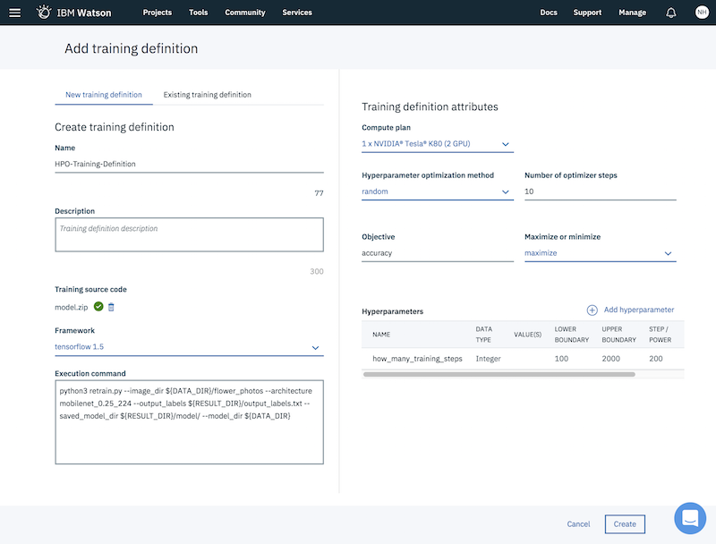

# Hyperparameter Optimization with IBM Watson Studio

This project includes sample code how to train a model with [TensorFlow](https://www.tensorflow.org/) and the [Deep Learning service](https://www.ibm.com/blogs/watson/2018/03/deep-learning-service-ibm-makes-advanced-ai-accessible-users-everywhere/) within Watson Studio. The sample shows how to use hyperparameter optimization (HPO) in experiments to easily find the best quality model.

As a starting point [TensorFlow For Poets](https://codelabs.developers.google.com/codelabs/tensorflow-for-poets/#0) is used to classify images of flowers via transfer learning. Via HPO the number of training steps is optimized.

This is a screenshot of IBM Watson Studio with a training definition and one hyperparamter 'how_many_training_steps' with values between 100 and 2000.




## Prerequisites 

Get a free [IBM Cloud](https://ibm.biz/nheidloff) lite account (no time restriction, no credit card required).

Create an instance of the [Machine Learning](https://console.bluemix.net/catalog/services/machine-learning) service. From the credentials get the user name, password and the instance id.

Install the IBM Cloud CLI with the machine learning plugin and set environment variables by following these [instructions](https://datascience.ibm.com/docs/content/analyze-data/ml_dlaas_environment.html).

Create an instance of the [Cloud Object Storage
](https://console.bluemix.net/catalog/services/cloud-object-storage) service and create HMAC credentials by following these [instructions](https://datascience.ibm.com/docs/content/analyze-data/ml_dlaas_object_store.html). Make sure to use 'Writer' or 'Manager' access and note the aws_access_key_id and aws_secret_access_key for a later step.

Install and configure the AWS CLI by following these [instructions](https://console.bluemix.net/docs/services/cloud-object-storage/cli/aws-cli.html#use-the-aws-cli).


## Training of the Model

Clone this repo:

```bash
$ git clone https://github.com/nheidloff/hyperparameter-optimization-ibm-watson-studio.git
```

Create two buckets (use unique names):

```bash
$ aws --endpoint-url=http://s3-api.dal-us-geo.objectstorage.softlayer.net --profile ibm_cos s3 mb s3://nh-flowers-input
$ aws --endpoint-url=http://s3-api.dal-us-geo.objectstorage.softlayer.net --profile ibm_cos s3 mb s3://nh-flowers-output
```

Download and extract Mobilenet and the images:

```bash
$ cd hyperparameter-optimization-ibm-watson-studio/data
$ wget http://download.tensorflow.org/models/mobilenet_v1_2018_02_22/mobilenet_v1_0.25_224.tgz
$ tar xvzf mobilenet_v1_0.25_224.tgz 
$ curl http://download.tensorflow.org/example_images/flower_photos.tgz \
    | tar xz -C tf_files
```

Upload bucket with MobileNet and data (use your unique bucket name):

```bash
$ cd xxx/hyperparameter-optimization-ibm-watson-studio/data
$ aws --endpoint-url=http://s3-api.dal-us-geo.objectstorage.softlayer.net --profile ibm_cos s3 cp . s3://nh-flowers-input/ --recursive 
```

Define the experiment, the training definition and the hyperparamter:

Open [IBM Watson Studio](https://dataplatform.ibm.com/) and create a new project (choose the 'Complete' option).

From the 'Assests' tab create a new experiment as done in this [screenshot](screenshots/experiment.png).

Create a training definition as done in this [screenshot](screenshots/trainingdef.png). You can copy and paste the command from [tf-train.yaml](model/tf-train.yaml).

Define the hyperparameter 'how_many_training_steps' as done in this [screenshot](screenshots/hyperparameter.png). 

Run the experiment with the training runs.

Download the saved models, the logs and the [results](screenshots/result.png).

```bash
$ cd xxx/hyperparameter-optimization-ibm-watson-studio/output
$ aws --endpoint-url=http://s3-api.dal-us-geo.objectstorage.softlayer.net --profile ibm_cos s3 sync s3://nh-flowers-output .
```

## Next Steps

To learn more about HPO check out the [documentation](https://dataplatform.ibm.com/docs/content/analyze-data/ml_dlaas_hpo.html?audience=wdp&context=analytics). As alternative to the web interface, experiments can also be used from Python notebooks and via CLIs.